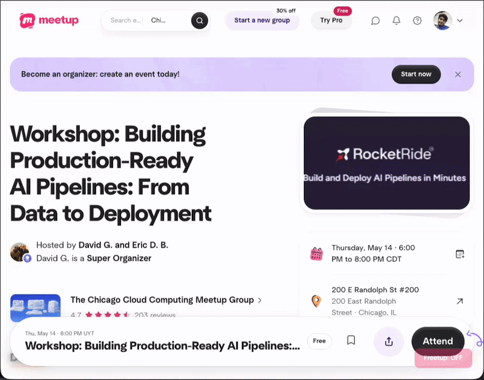

# freetup

Unblur your meetup.com experience



## Installation

```bash
git clone https://github.com/FrissA/freetup.git
cd freetup
pnpm install
```

## Development

```bash
pnpm dev           # Chrome
pnpm dev:firefox   # Firefox
```

## Build

```bash
pnpm build           # Chrome
pnpm build:firefox   # Firefox
```

## Load the extension

**Chrome**
1. Go to `chrome://extensions`
2. Enable **Developer mode** (top-right toggle)
3. Click **Load unpacked**
4. Select the `.output/chrome-mv3` folder

**Firefox**
1. Go to `about:debugging#/runtime/this-firefox`
2. Click **Load Temporary Add-on…**
3. Select any file inside `.output/firefox-mv2`

## Usage

Navigate to any Meetup.com event page. A **Freetup** toggle button appears in the top-right corner — click it to remove the paywall overlay. The setting persists across page loads.

## Tech

- [WXT](https://wxt.dev) — browser extension framework
- React 19, TypeScript

## License

MIT — see [LICENSE](LICENSE)
